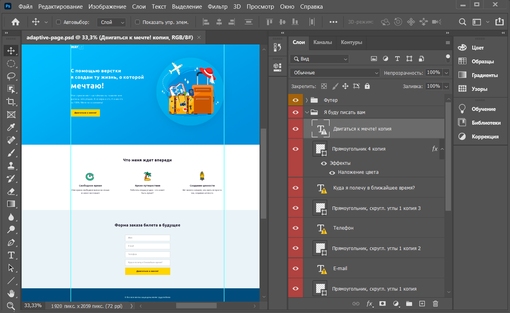
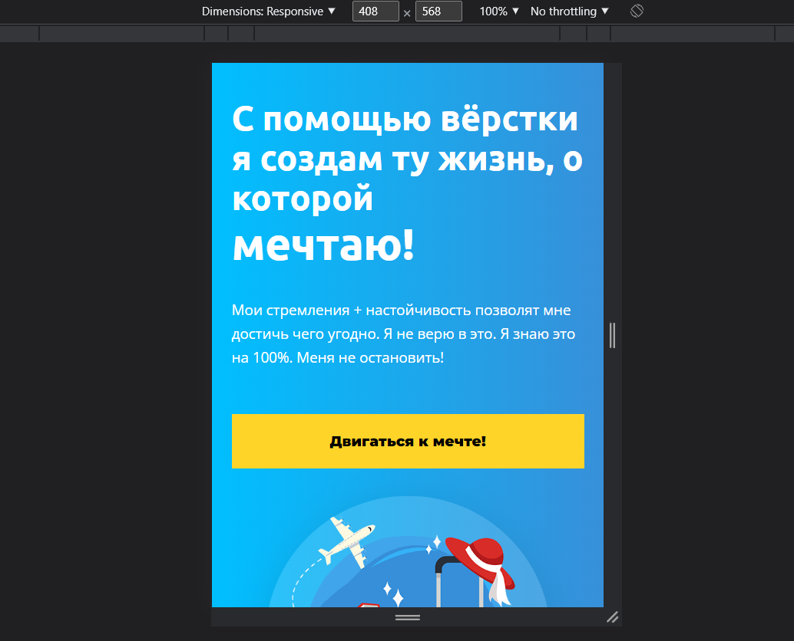
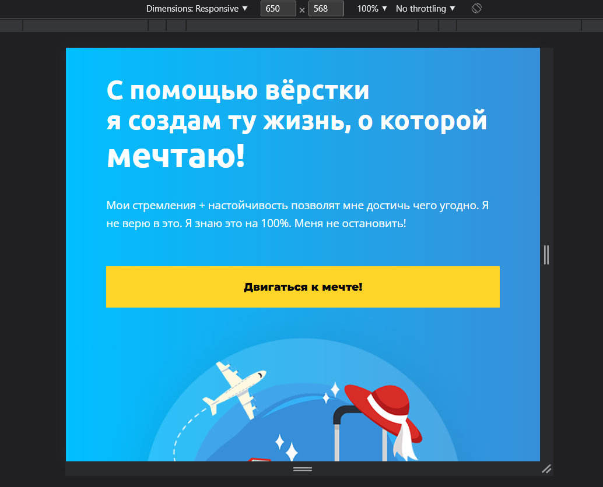

# Adaptive-page

In this project, I made up a site based on a layout.

Using Photoshop, I exported images from the layout; determined which fonts it contains and connected them from Google Fonts; using the generator created a gradient in the first section.

Media query diapazon are based on Bootstrap standards.